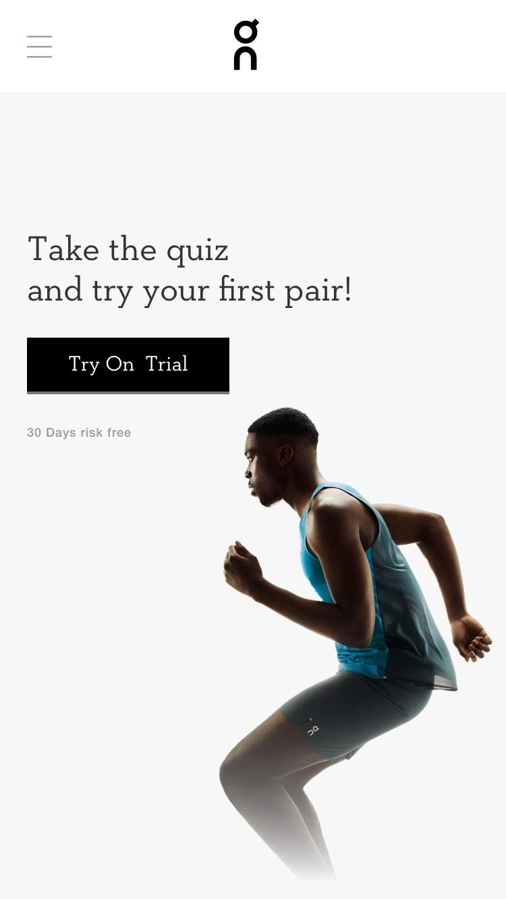
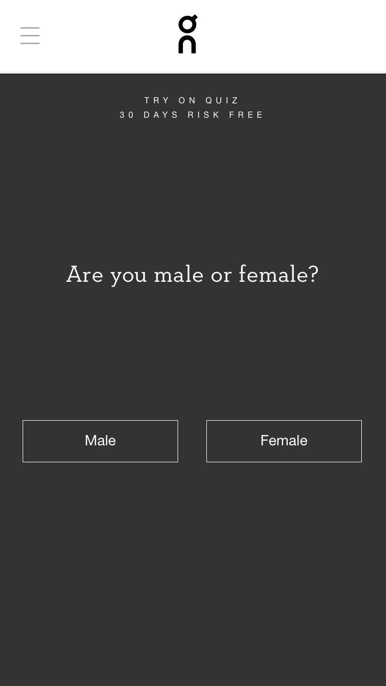
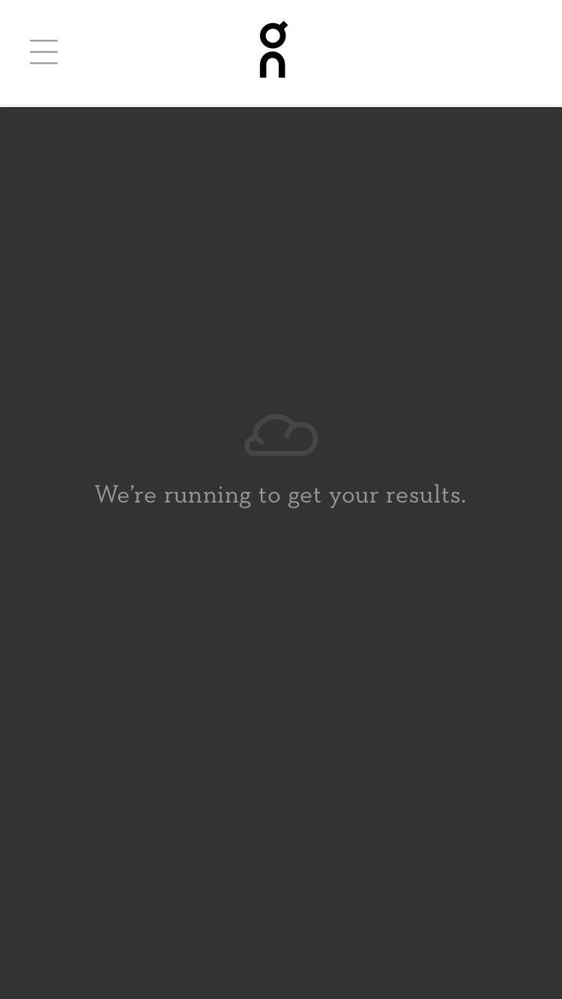
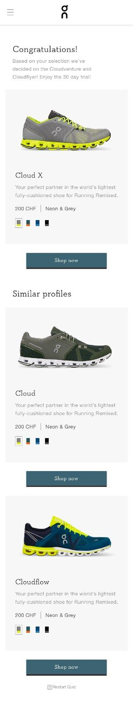

## Frontend Engineer Use Case

### Your task
Build a small quiz for runners to find their perfect shoe.

### General notes
- We have provided you with a JSON file (`data.json`) with all the data concerning questions, answers and shoes.
- Depending on how a question is answered, users can be taken to different follow-up questions. You will find the `nextQuestion` in the JSON file.
- A blank `nextQuestion` means the quiz is finished and the results are presented (the best fitting shoes).
- Also depending on the answer, we update the ranking of shoes. How much each shoe gains per answer is listed in the JSON file (`ratingIncrease`).
- Only develop for mobile; no need for desktop adaptation.
- Skip the main navigation, concentrate on the quiz.
- For the final results screen, don’t follow the design of the screenshot too closely. Only listing the shoes together with a title and an introduction sentence is fine.
- You don’t have to use the original fonts. Just go with some similar Google fonts.
- Assets can be found in the assets directory.

### Technical implementation
- If you already have some knowledge of Vue.js, create an app with vue-cli and show off your skills. If you are not familiar with Vue.js yet, vanilla JS or another frontend framework like React is fine too. Feel free to use a boilerplate to get started.
- Please follow the design of the layouts below.
- Add animations and transitions at your discretion.
- If you have any questions, do not hesitate to get in touch!

### Layouts
#### Start Screen

#### Question Screen

#### Loading Screen

#### Results Screen

Have fun and good luck!
